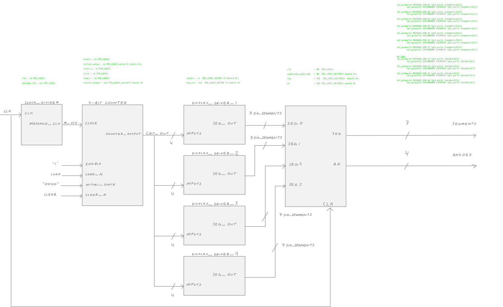

## scrolling 7-segment display

**table of contents**

1.  [objectives](#objectives)
2.  [prerequisites](#prerequisites)
3.  [block diagram](#block-diagram)
4.  [components in design](#components)
	1.  [source 1 `clock-divider.vhd`](#source-1-clock-dividervhd)
	2.  [source 2 `counter.vhd`](#source-2-countervhd)\
	3.  [source 3 - 6 `display-driver-3-6.vhd`](#source-3---6-display-driver-3-6vhd)
	4.  [source 7 `LEDdisplay.vhd`](#source-7-LEDDisplayvhd)
	5.  [source 8 `toplevel.vhd`](#source-8-toplevelvhd)
	6.  [`toplevel.xdc`](#toplevelxdc)
	7.  [report](#report)

### objectives

The objective of this laboratory exercise is to learn how to use modular design in VHDL to display a scrolling phrase up to 16 characters long on the 4 7-segment displays on the Basys 3 board.


### prerequisites

1.  what components will be used in completing this lab?

`clock_divider.vhd`
`counter.vhd`
`display_driver_1.vhd`
`display_driver_2.vhd`
`display_driver_3.vhd`
`display_driver_4.vhd`
`LEDdisplay.vhd`
`toplevel.vhd`
`toplevel.xcd`

2.  how many connections (signals) will connect the counter to the display driver?

The counter will have 4 signals connecting to each of the display drivers, the variable for the signals is a vector of length 4. 

`signal counter_signal: STD_LOGIC_VECTOR(3 downto 0);`

```vhdl
signal counter_signal : STD_LOGIC_VECTOR(3 downto 0) := "0000";

begin

process (clock, clear_n)

begin
	if clear_n = '0' then
		counter_signal <= (others => '0');
	
	elsif (clock'event and clock = '1') then
		if load_n = '0' then
			counter_signal <= counter_signal + 1;
		else
			if enable = '1' then
				counter_signal <= counter_signal + 1;
			else
				counter_signal <= counter_signal;
			end if;
		end if;
	end if;
end process;

counter_output <= counter_signal;

end Behavioral;
```

3.  how will we test the result of this lab?

The result of this lab will be tested by using the Basys 3 board and the Xilinx Vivado software. The Basys 3 board will be used to display the scrolling phrase on the 4 7-segment displays. The Xilinx Vivado software will be used to simulate the scrolling phrase on the 4 7-segment displays.  I will display my name or any creative phrase similar to the example below.

each column above corresponds to each display driver

```
1 2 3 4  display_drivers
- - - E
- - E E
- E E C
E E C S
E C S -
C S - -
S - - E
- - E E
- E E C
E E C S
E C S -
C S - -
S - - E
- - E E
- E E C
E E C S
```

## block-diagram



## components

### source 1 `clock-divider.vhd`

This component is responsible to take the on-board 450MHz clock input and divide it so that the period of the resulting clock is about 1 second.  We will call this new clock as `message_clk`.  This will control how fast or slow your message will scroll on the 4 7-segment displays.  You can test this component by hooking it up to an LED (say LD0) and make sure it blinks every 1 second or so).

[clock-divider](./src/clock_divider.vhd)
```vhdl
entity clock_divider is
	Port (  clk		: in STD_LOGIC;
		message_clk	: out STD_LOGIC);
end clock_divider;

architecture Behavioral of clock_divider is

-- create a signal called "count" (26 bit vector), that is signal declaration.
-- look at the code snippet below which is the counter that depends on clock signal

signal count : STD_LOGIC_VECTOR(25 downto 0)

begin

process(clk)
begin
	if (clk'event and clk = '1') then
		count <= count + 1;
	end if;
end process;

message_clk <= count(24);

end Behavioral;

```

### source 2 `counter.vhd`

I will then design a 4-bit counter that runs at the rate of `message_clk` which is the output of the clock divider, that is now the clock input of the counter).  The output will be a 4-bit vector called `counter_output`.  The counter also has extra inputs:  `enable`, `initial_value`, `clear_n`, `load_n`.

[counter.vhd](./src/counter.vhd)
```vhdl
entity counter is
	Port (  enable 		: in STD_LOGIC;

		-- initial_value is a 4-bit signal that contains an initial value to be 
		-- loaded into the counter
		load_n		: in STD_LOGIC;
		counter_output  : out STD_LOGIC_VECTOR(3 downto 0));
end counter;

architecture Behavioral of counter is

signal counter_signal : STD_LOGIC_VECTOR(3 downto 0) := "0000";

begin

process (clock, clear_n)

begin

	-- if clean_n is '0', (_n = negative logic, on = '0')
	if clear_n = '0' then
		-- then counter resets to zero "0000"
		counter_signal <= (others => '0');
	
	elsif (clock'event and clock = '1') then
		if load_n = '0' then
			counter_signal <= counter_signal + 1;
		else
			-- if enable is on (positive logic, on = '1)
			if enable = '1' then
				-- then the counter increments its value with time
				counter_signal <= counter_signal + 1;
			-- if enable is off (negative logic, off = '0')
			else
				-- then else it remains at the same value
				counter_signal <= counter_signal;
			end if;
		end if;
	end if;
end process;

counter_output <= counter_signal;

end Behavioral;
```

### source 3 `display_driver_1.vhd`

Next are the 4 display drivers (analogous to the [`display_driver.vhd`](https://wiki.ittc.ku.edu/ittc_wiki/images/0/0f/Display_driver.vhd)
`display_driver_1.vhd`
`display_driver_2.vhd`
`display_driver_3.vhd`
`display_driver_4.vhd`


```vhdl
library IEEE;
use IEEE.STD_LOGIC_1164.ALL;
use IEEE.STD_LOGIC_ARITH.ALL;
use IEEE.STD_LOGIC_UNSIGNED.ALL;

---- Uncomment the following library declaration if instantiating
---- any Xilinx primitives in this code.
--library UNISIM;
--use UNISIM.VComponents.all;

entity display_driver is
    Port ( inputs : in  STD_LOGIC_VECTOR (3 downto 0);
           seg_out : out  STD_LOGIC_VECTOR (6 downto 0));
end display_driver;

architecture Behavioral of display_driver is

begin

with inputs select
seg_out <=
"1000000" when x"0" ,
"1111001" when x"1" ,
"0100100" when x"2" ,
"0110000" when x"3" ,
"0011001" when x"4" ,
"0010010" when x"5" ,
"0000010" when x"6" ,
"1111000" when x"7" ,
"0000000" when x"8" ,
"0010000" when x"9" ,
"0001000" when x"A" ,
"0000011" when x"B" ,
"1000110" when x"C" ,
"0100001" when x"D" ,
"0000110" when x"E" ,
"0001110" when others;

end Behavioral;
```

```
E E C S
1 2 3 4  display_drivers

- - - E
- - E E
- E E C
E E C S
E C S -
C S - -
S - - E
- - E E
- E E C
E E C S
E C S -
C S - -
S - - E
- - E E
- E E C
E E C S
```

```vhdl
L O V E
1 2 3 4  display_drivers

- - - L		
- - L O
- L O V
L O V E
L V E -
V E - -
E - - L
- - L O
- L O V
L O V E
L V E -
V E - -
E - - L
- - L O
- L O V
L O V E
```


 - = "1111110" = "abcdegf"
 L = "1110001" = "abcdefg"
 O = "0000001" = "abcdefg"
 V = "1000001" = "abcdefg"
 E = "0110000" = "abcdefg"

### `display_driver_2.vhd`

```vhdl
-
-
L
O
V
E
_
_
L
O
V
E
_
_
L
O
```

### `display_driver_1.vhd`

```
1 is OFF
0 is ON

   "abcdefg" is the 7-segment display output

-  "1111110" when x"0" ,
-  "1111110" when x"1" ,
-  "1111110" when x"2" ,
L  "1110001" when x"3" ,
L  "1110001" when x"4" ,
V  "1000001" when x"5" ,
E  "0110000" when x"6" ,
-  "1111110" when x"7" ,
-  "1111110" when x"8" ,
L  "1110001" when x"9" ,
L  "1110001" when x"A" ,
V  "1000001" when x"B" ,
E  "0110000" when x"C" ,
-  "1111110" when x"D" ,
-  "1111110" when x"E" ,
L  "1110001" when x"F" ,
```

```
 - = "1111110" = "abcdegf"
 L = "1110001" = "abcdefg"
 O = "0000001" = "abcdefg"
 V = "1000001" = "abcdefg"
 E = "0110000" = "abcdefg"
```

## 8 = "0000000" = "abcdefg"
```
	  a = 0
	 ------- 
	|       |
  0 = f |       | b = 0
	|       |
	 ------- 
	| g = 0 |
  0 = e	|       | c = 0
	|       |
	 ------- 
	  d = 0
````

## 0 = "0000001" when x"0"
```
	  a = 0
	 ------- 
	|       |
  0 = f |       | b = 0
	|       |
	       
	| g = 1 |
  0 = e	|       | c = 0
	|       |
	 ------- 
	  d = 0
````

## - = "1111110" = "abcdegf"
```
	  a = 1
	  
	         
  1 = f           b = 1
	         
	 -------
	  g = 0  
  1 = e	          c = 1
	         
	 
	  d = 1
````


## L = "1110001" = "abcdefg"
```
	  a = 1
	 
	|        
  0 = f |         b = 1
	|        
	       
	| g = 1  
  0 = e	|         c = 1
	|        
	 ------- 
	  d = 0
1110001

````

## O = "0000001" = "abcdefg"
```
	  a = 0
	 ------- 
	|       |
  0 = f |       | b = 0
	|       |
	       
	| g = 1 |
  0 = e	|       | c = 0
	|       |
	 ------- 
	  d = 0
0000001
````

## V = "1000001" = "abcdefg"
```
	  a = 1
                  
	|       |
  0 = f |       | b = 0
	|       |
	       
	| g = 1 |
  0 = e	|       | c = 0
	|       |
	 ------- 
	  d = 0
1000001
````
## E = "0110000" = "abcdefg"
```
	  a = 0
	 ------- 
	|        
  0 = f |         b = 1
	|        
	 ------- 
	| g = 0  
  0 = e	|         c = 1
	|        
	 ------- 
	  d = 0
0110000

## - = "1111110" = "abcdegf"
## L = "1110001" = "abcdefg"
## O = "0000001" = "abcdefg"
## V = "1000001" = "abcdefg"
## E = "0110000" = "abcdefg"
````

## source 7 [`LEDdisplay.vhd`](https://wiki.ittc.ku.edu/ittc_wiki/images/4/4b/LEDdisplay.vhd)


```vhdl
library ieee;
use ieee.std_logic_1164.all;
Library UNISIM;
use UNISIM.vcomponents.all;


ENTITY Mux4by7 IS
	-- No carry in or carry out for demonstration purposes
	PORT (
	--	clk: IN  STD_LOGIC;
        Input0       		: IN  STD_LOGIC_VECTOR(6 downto 0);
        Input1       		: IN  STD_LOGIC_VECTOR(6 downto 0);
        Input2       		: IN  STD_LOGIC_VECTOR(6 downto 0);
        Input3       		: IN  STD_LOGIC_VECTOR(6 downto 0);
        Control       		: IN  STD_LOGIC_VECTOR(1 downto 0);
        Output     		: OUT STD_LOGIC_VECTOR(6 downto 0)
	);
END Mux4by7;


ARCHITECTURE procedural of Mux4by7 IS
signal seg0,seg1 : std_logic_vector(6 downto 0);

BEGIN

dispMUX00: MUXF5 port map (seg0(0),Input0(0),Input1(0),Control(0));
dispMUX01: MUXF5 port map (seg1(0),Input2(0),Input3(0),Control(0));
dispMUX02: MUXF6 port map (Output(0),seg0(0),seg1(0),Control(1));

dispMUX10: MUXF5 port map (seg0(1),Input0(1),Input1(1),Control(0));
dispMUX11: MUXF5 port map (seg1(1),Input2(1),Input3(1),Control(0));
dispMUX12: MUXF6 port map (Output(1),seg0(1),seg1(1),Control(1));

dispMUX20: MUXF5 port map (seg0(2),Input0(2),Input1(2),Control(0));
dispMUX21: MUXF5 port map (seg1(2),Input2(2),Input3(2),Control(0));
dispMUX22: MUXF6 port map (Output(2),seg0(2),seg1(2),Control(1));

dispMUX30: MUXF5 port map (seg0(3),Input0(3),Input1(3),Control(0));
dispMUX31: MUXF5 port map (seg1(3),Input2(3),Input3(3),Control(0));
dispMUX32: MUXF6 port map (Output(3),seg0(3),seg1(3),Control(1));

dispMUX40: MUXF5 port map (seg0(4),Input0(4),Input1(4),Control(0));
dispMUX41: MUXF5 port map (seg1(4),Input2(4),Input3(4),Control(0));
dispMUX42: MUXF6 port map (Output(4),seg0(4),seg1(4),Control(1));

dispMUX50: MUXF5 port map (seg0(5),Input0(5),Input1(5),Control(0));
dispMUX51: MUXF5 port map (seg1(5),Input2(5),Input3(5),Control(0));
dispMUX52: MUXF6 port map (Output(5),seg0(5),seg1(5),Control(1));

dispMUX60: MUXF5 port map (seg0(6),Input0(6),Input1(6),Control(0));
dispMUX61: MUXF5 port map (seg1(6),Input2(6),Input3(6),Control(0));
dispMUX62: MUXF6 port map (Output(6),seg0(6),seg1(6),Control(1));

END procedural;


--top level LED display--
library ieee;
use ieee.std_logic_1164.all;
use ieee.std_logic_unsigned.all;

Library UNISIM;
use UNISIM.vcomponents.all;

ENTITY LEDdisplay IS
	PORT (
		  clk					: IN  STD_LOGIC;
		  seg0,seg1,seg2,seg3		: IN  STD_LOGIC_VECTOR(6 downto 0);
        seg       		: OUT  STD_LOGIC_VECTOR(6  downto 0);
		  an					: OUT STD_LOGIC_VECTOR(3 downto 0));		  
END LEDdisplay;

ARCHITECTURE structural of LEDdisplay is

component Mux4by7 IS
	PORT (
        Input0       		: IN  STD_LOGIC_VECTOR(6 downto 0);
        Input1       		: IN  STD_LOGIC_VECTOR(6 downto 0);
        Input2       		: IN  STD_LOGIC_VECTOR(6 downto 0);
        Input3       		: IN  STD_LOGIC_VECTOR(6 downto 0);
        Control       		: IN  STD_LOGIC_VECTOR(1 downto 0);
        Output     		: OUT STD_LOGIC_VECTOR(6 downto 0)
	);
END component Mux4by7;

-- Enumerated Data Type for State
		TYPE STATE_TYPE IS (st00,st01,st10,st11);
		SIGNAL cur_state,next_state: STATE_TYPE;
		
signal control : std_logic_vector(1 downto 0) := "00";
signal Counter_Signal : std_logic_vector(15 downto 0);
signal downclk : std_logic;		

BEGIN

-- port mapping --
dispMUX00: Mux4by7 port map (seg0,seg1,seg2,seg3,control,seg);
--end port mapping --

-- next state logic --
next_state <= 	st01 when (cur_state = st00) else
					st10 when (cur_state = st01) else
					st11 when (cur_state = st10) else
					st00 when (cur_state = st11) else
					cur_state;
-- end next state logic --

-- internal signals --
an <= 	"1110" when (cur_state = st00) else
			"1101" when (cur_state = st01) else
			"1011" when (cur_state = st10) else
			"0111" when (cur_state = st11);
			
control <= 	"00" when (cur_state = st00) else
				"01" when (cur_state = st01) else
				"10" when (cur_state = st10) else
				"11" when (cur_state = st11);
			
downclk <= Counter_Signal(14);
--end internal signals --

-- state process --
process(downclk)
begin
	if rising_edge(downclk) then
		cur_state <= next_state;
	end if;
end process;
-- end state process --
			
-- clk down converter --
PROCESS (clk)
BEGIN				
	IF (clk'event and clk='1') THEN
				Counter_Signal <= Counter_Signal + 1; -- Counter updates every clock cycle @ 25Mhxz				
	END IF;
END PROCESS;
-- end clk down converter --
	

END structural;
```

## source 8 `toplevel.vhd`

The toplevel structural VHDL module for the block diagram is provided below, I will declare the above components and instantiate (port map `=>`) them to reflect the interconnections from the diagram above.

- toplevel entity with required input and output ports:  `clk`, `segments`(7 bits), `anodes`(4 bits), `enable`, `load`, `clear`, `initial_value`, 

- declare components `clock divider`, `counter`, `display_driver_1`, `display_driver_2`, `display_driver_3`, `display_driver_4`, `LEDdisplay`

- declare signals `m_clk`, `cn_out`, `sigs

# `toplevel.xdc`

7.  [report](#report)

