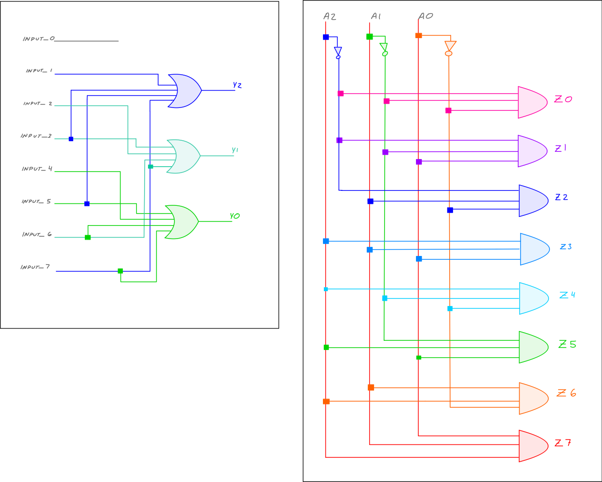
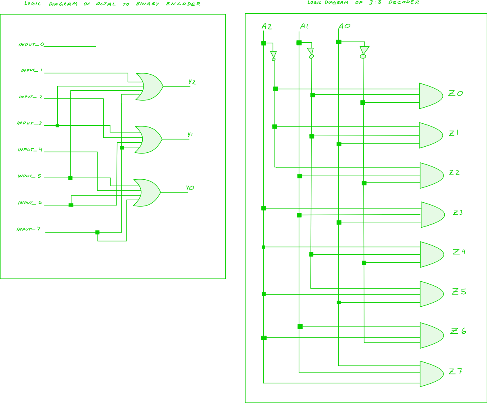

# encoder and decoder

**table of contents**

1.  [objective](#objective)
2.  [discussion](#discussion)
3.  [tasks](#tasks)
	1. [step 1](#step-1)
	2. [step 2](#step-2)
	3. [step 3](#step-3)
	4. [step 4](#step-4)
4.  [report](#report)

## objective

This lab will comprise of decoder and encoder circuits.
Decoder circuits have n inputs and up to 2n outputs.
One output is associated with each possible binary input.
Encoders are the opposite of decoders.
Encoders have 2n inputs and n outputs.

The design and implementation of this program will be a 3-to-8 decoder and 8-to-3 encoder.

## discussion

**decoder**

A decoder can take the form of a multiple-input, multiple-output logic circuit that converts coded inputs into coded outputs, where the input and output codes are different e.g. n-to-2n, binary-coded decimal decoders.  Decoding is necessary in applications such as data multiplexing, 7-segment display, and memory address decoding.

**encoder**

Encoders are combinational logic circuits and they are exactly opposite of decoders.  They accept one or more inputs and generate a multibit output code.  An encoder has `m` input and `n` output lines.  Out of the `m` input lines only one is activated at a time and produces equivalent code on output `n` lines.  If a device output code has fewer bits than the input code has, the device is usually called an encoder.  The logic circuit of a 8-to-3 encoder and a 3-to-8 decoder is presented below.

**logic diagram of octal to binary encoder | logic diagram of 3:8 decoder**

**encode** $2^{n} => n$

**decode** $n => 2^{n}$





## tasks

### step 1

**1.  the truth table for the 3-to-8 decoder**


| **input(x)**  |        |        |        |  **output(y)**   |               |  
|:-------------:|:------:|:------:|:------:|:----------------:|:-------------:|
|               | **A2** | **A1** | **05** |                  |     **Y2**    |
|               |   0    |   0    |   0    |                  |     $Z_{0}$   |
|               |   0    |   0    |   1    |                  |     $Z_{1}$   |
|               |   0    |   1    |   0    |                  |     $Z_{2}$   |
|               |   0    |   1    |   1    |                  |     $Z_{3}$   |
|               |   1    |   0    |   0    |                  |     $Z_{4}$   |
|               |   1    |   0    |   1    |                  |     $Z_{5}$   |
|               |   1    |   1    |   0    |                  |     $Z_{6}$   |
|               |   1    |   1    |   1    |                  |     $Z_{7}$   |

<br>

**2.  input x is a 3 bit vector**

**3.  output y is a 8 bit vector**

**4.  to describe the behavior of the decoder, the following logical equations will describe how the outputs are governed**

output equtions of the 3:8 decoder

$Z_{0} = \overline{A_{0}} \overline{A_{1}} \overline{A_{2}}$

$Z_{1} = {A_{0}} \overline{A_{1}} \overline{A_{2}}$

$Z_{2} = \overline{A_{0}} {A_{1}} \overline{A_{2}}$

$Z_{3} = {A_{0}} {A_{1}} {A_{2}}$

$Z_{4} = \overline{A_{0}} \overline{A_{1}} {A_{2}}$

$Z_{5} = {A_{0}} \overline{A_{1}} {A_{2}}$

$Z_{6} = \overline{A_{0}} {A_{1}} {A_{2}}$

$Z_{7} = {A_{0}} {A_{1}} {A_{2}}$

### step 2

1.  create a new project for the decoder in my H:// drive

2.  generate a VHDL file for the above schematic provided and include it in the project


```vhdl
library IEEE;
use IEEE.STD_LOGIC_1164.ALL;


entity Decoder is
	Port ( x : in STD_LOGIC_VECTOR (0 to 2);
	       y : out STD_LOGIC_VECTOR (0 to 7));
end Decoder;

architecture Behavioral of Decoder is

begin
	y(0) <= (not x(0)) and (not x(1)) and (not x(2));
	y(1) <= (    x(0)) and (not x(1)) and (not x(2));
	y(2) <= (not x(0)) and (    x(1)) and (not x(2));
	y(3) <= (    x(0)) and (    x(1)) and (    x(2));
	y(4) <= (not x(0)) and (not x(1)) and (    x(2));
	y(5) <= (    x(0)) and (not x(1)) and (    x(2));
	y(6) <= (not x(0)) and (    x(1)) and (    x(2));
	y(7) <= (    x(0)) and (    x(1)) and (    x(2));

end Behavioral;
```

### step 3

**1.  the truth table for 3-to-8 encoder shown in the figure above.**

|   **input(x)** | |  |  |  | |  |  |  |   **output(y)** |  |  |  |
|:--:|:--:|:--:|:--:|:--:|:--:|:--:|:--:|:--:|:--:|:--:|:--:|:--:|
|    |**I7** | **I6** | **I5** | **I4** | **I3** | **I2** | **I1** | **I0** |    | **Y2** | **Y1** | **Y0** |
|    | 0  | 0  | 0  | 0  | 0  | 0  | 0  | 0  |    | 0  | 0  | 0  |
|    | 0  | 0  | 0  | 0  | 0  | 0  | 1  | 0  |    | 1  | 0  | 0  |
|    | 0  | 0  | 0  | 0  | 0  | 1  | 0  | 0  |    | 0  | 1  | 0  |
|    | 0  | 0  | 0  | 0  | 1  | 0  | 0  | 0  |    | 1  | 1  | 0  |
|    | 0  | 0  | 0  | 1  | 0  | 0  | 0  | 0  |    | 0  | 0  | 1  |
|    | 0  | 0  | 1  | 0  | 0  | 0  | 0  | 0  |    | 1  | 0  | 1  |
|    | 0  | 1  | 0  | 0  | 0  | 0  | 0  | 0  |    | 0  | 1  | 1  |
|    | 1  | 0  | 0  | 0  | 0  | 0  | 0  | 0  |    | 1  | 1  | 1  |

**2.  input(x) is a 8-bit vector**

**3.  output(y) is a 3-bit vector**

**4.  logical equations for the outputs are:**


$Y_{0} = I_{4} + I_{5} + I_{6} + I_{7}$

$Y_{1} = I_{2} + I_{3} + I_{6} + I_{7}$

$Y_{2} = I_{1} + I_{3} + I_{5} + I_{7}$

**5.  How do you verify the correctness of the design on the FPGA board?**

In order to verify the correctness of the design on the FPGA board you must test the design with different inputs and compare the outputs with the expected outputs.

### step 4

1.  the following VHDL code is for the 8-to-3 encoder on the Basys3 Board

```vhdl
library IEEE;
use IEEE.STD_LOGIC_1164.ALL;

entity Encoder is
	Port ( x : in STD_LOGIC_VECTOR(0 to 7);
	       y : out STD_LOGIC_VECTOR(0 to 2));

end Encoder;

architecture Behavioral of Encoder is

begin

	y(0) <= x(4) or x(5) or x(6) or x(7);
	y(1) <= x(2) or x(3) or x(6) or x(7);
	y(2) <= x(1) or x(3) or x(5) or x(7);

end Behavioral;
```


