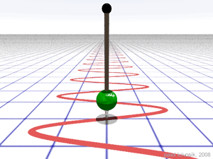
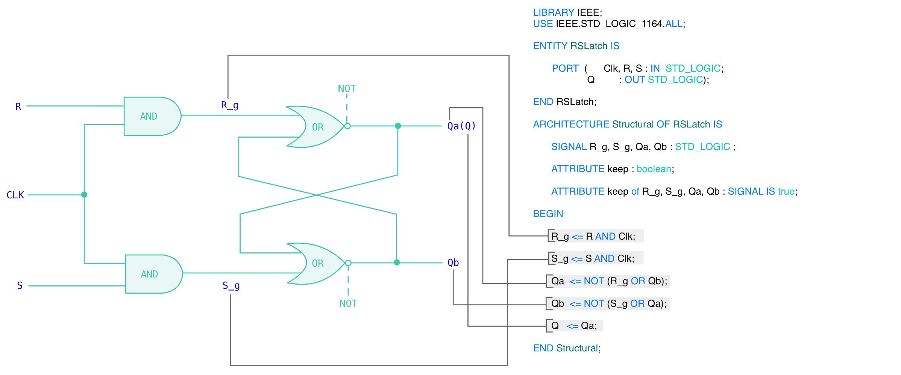

# latches, flip-flops, registers

**table of contents**

1.  [objective](#objective)
2.  [discussion](#discussion)
3.  [tasks](#tasks)
	1.  [preconditions](#preconditions)
	2.  [step 1 diagram](#step-1-diagram)
	3.  [step 2 RSLatch](#step-2-rslatch)
	4.  [step 3 gated D latch](#step-3-gated-d-latch)
	5.  [step 4 master slave D flip-flop](#step-4-master-slave-d-flip-flop)
4.  [report](#report)


## objective

the objective of this program is to investigate latches, flip-flops, and registers.

## discussion

**latches**

Latches are circuits that store sigle bits.  One basic type of latch is the `RS-latch` which has two inputs, labeled _Set_ and _Reset_.  These two inputs, which are typically labeled `S` and `R`, provide a means for changing the state `Q` of the circuit.  

- When `R = 0` and `S = 0`, the latch maintains its existing state.  

- When `R = 0` and `S = 1` the latch is siad to be in the _Set_ state.  In this case, the circuit output is `1`.

- When `R = 1` and `S = 0` the latch is said to be in the _Reset_ state.  In this case, the circuit output is `0`.

- When `R = 1` and `S = 1` the circuit is said to be in an _undefined_ or _illegal_ state for the RS-latch.  In this case the circuit output is `0`.

**flip-flop**

A flip-flop is the basic sequential circuit element that stores one bit.  A flip-flop changes its output state at the edge of a controlling clock signal.

- When a set of `n` flip-flops is used to store `n` bits of information, we refer to these flip-flops as registers.  A common clock is used to each flip-flop in a **register**.

## tasks

Step-wise refinement tasks in order to complete this program.

### preconditions

The following are questions that address the major precondition for this program.

**1.  What is the purpose of a latch?**

	The purpose of a latch is to store a single bit of information, and to change that information when a signal is applied to the latch.

**2.  How many flip-flops are required to implement a 16-bit register?**

	`n` flip-flips are required to implement a `n`-bit register, thus 16 flip-flops are required to implement a 16-bit register.

**3.  What is the purpose of the `VHDL ATTRIBUTE` statement in the code snippet shown on the following** [figure 1 - gated `RS-latch` circuit](#figure-1---gated-rs-latch)

**4.  How will we test the functionality of the gated D latch in this lab?**

**5.  Suppose you are given a 100-MHz signal, how will you generate a 50-MHz and 25-MHz clock signal?**

### signal frequency

<p align="center">
	
</p>

megahertz (106 Hz, MHz) is a unit of frequency equal to one million hertz (1,000,000 Hz).  The symbol for megahertz is MHz.  The symbol for hertz is Hz.

Frequency is the number of occurrences of a repeating event per unit of time.[1] It is also occasionally referred to as temporal frequency to emphasize the contrast to spatial frequency, and ordinary frequency to emphasize the contrast to angular frequency. Frequency is expressed in units of hertz (Hz) which is equivalent to one (event) per second.

Sometimes the adjectival form "per second" was omitted, so that "megacycles" (Mc) was used as an abbreviation of "megacycles per second" (that is, megahertz (MHz)).

In computers, most central processing units (CPU) are labeled in terms of their clock rate expressed in megahertz (106 Hz)

In computing, the clock rate or clock speed typically refers to the frequency at which the clock generator of a processor can generate pulses, which are used to synchronize the operations of its components,[1] and is used as an indicator of the processor's speed. It is measured in the SI unit of frequency hertz (Hz).

The clock rate of the first generation of computers was measured in hertz or kilohertz (kHz), the first personal computers (PCs) to arrive throughout the 1970s and 1980s had clock rates measured in megahertz (MHz), and in the 21st century the speed of modern CPUs is commonly advertised in gigahertz (GHz). This metric is most useful when comparing processors within the same family, holding constant other features that may affect performance.


**orders of magnitude of clock rates**

| order of magnitude | clock rate |
|:------------------:|:----------:|
| 10^0               | 1 Hz       |
| 10^3               | 1 kHz      |
| 10^6               | 1 MHz      |
| 10^9               | 1 GHz      |

- 1 Hz is the frequency of a clock that ticks once every second.
- 1 MHz is the frequency of a clock that ticks once every millionth of a second.

Given a 100-MHz signal, we can generate a 50-MHz and 25-MHz clock signal by dividing the 100-MHz signal by 2 and 4, respectively.

$$ 100 \text{MHz} = \frac{100 \text{MHz}}{2} = 50 \text{MHz} $$

$$ 100 \text{MHz} = \frac{100 \text{MHz}}{4} = 25 \text{MHz} $$

## step 1 diagram

### figure 1 - gated `RS-latch` circuit


<p align="center">
	
</p>

Xilinx FPGAs include flip-flops that are available for implementing a users' circuit.  Later in this README there will be an explaination on how to make use of these flip-flops.  However initially, the following will show how storage elements can be created in a FPGA without using its dedicated flip-flops.

The following figure depicts a **gated RS latch circuit**.  

A style of VHDL code that uses logic expressions to describe this circuit is given in the code snippet below.  If this latch is implemented in a FPGA that has 4-input look-up tables (LUTs), then the only one lookup table is needed.


`RS-latch` circuit inputs and outputs

| input R | input S | output Q |       state of latch       |
|:-------:|:-------:|:--------:|:--------------------------:|
|    0    |    0    |    0     |  maintain existing state   |
|    0    |    1    |    1     |           Set state	    |
|    1    |    0    |    0     |          Reset state	    |
|    1    |    1    |    0     | undefined or illegal state |


```vhdl
-- A gated RS latch described the hard way
LIBRARY IEEE;
USE IEEE.STD_LOGIC_1164.ALL;

ENTITY RSLatch IS
    PORT ( Clk, R, S : IN STD_LOGIC;
           Q         : OUT STD_LOGIC);

END RSLatch ;

ARCHITECTURE Structural OF RSLatch IS

	SIGNAL R_g, S_g, Qa, Qb : STD_LOGIC ;

	ATTRIBUTE keep : boolean;
	
	ATTRIBUTE keep of R_g, S_g, Qa, Qb : SIGNAL IS true;

BEGIN
	R_g <= R AND Clk;
  	
	S_g <= S AND Clk;
  	
	Qa <= NOT (R_g OR Qb);
  	
	Qb <= NOT (S_g OR Qa);
  	
	Q <= Qa;

END Structural;

```
